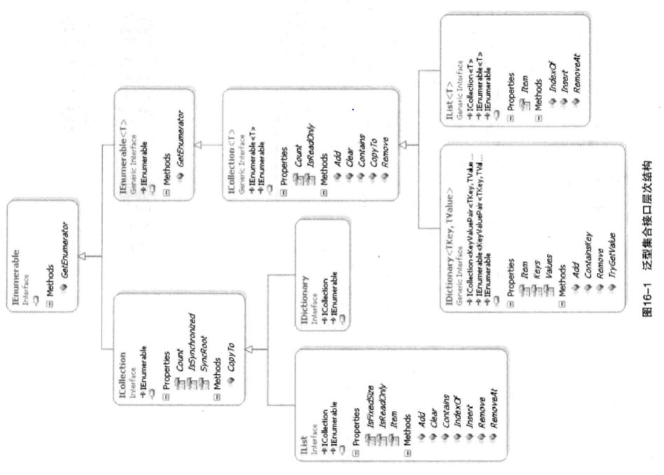

# 第16章 构建自定义集合
## 16.1更多集合接口

* IList<T>与IDictionary<TKey,TValue>
   字典类一般只按照键进行索引，而不按照位置索引。
   列表则相反，它按特定顺序存储值并按位置访问它们。

* ICollection<T>
   IList<T>和IDictionary<TKey,TValue>都实现了ICollection<T>。ICollection<T>是从IEnumerable<T>派生的，包含两个成员：
  * Count属性返回集合中的元素总数。要真正做到这一点，集合必须支持按索引来获取值，这个功能是ICollection<T>接口不包含的。
  * CopyTo()方法允许将集合转换成数组。该方法包含一个index参数，允许指定在目标数组的什么位置插入元素。

## 16.2 主要集合类
* 列表集合：List<T>
  具有与数组相识的属性，关键在于随着元素数量的增多，这种类会自定扩展，可以通过显式调用TrimToSize()或Capacity来缩小。
> **自定义集合排序**
> 如果元素类型实现了泛型IComparabla<T>接口或者非泛型IComparable接口，排序算法默认就用它来决定排序顺序。
> 如果元素类型没有实现IComparable<T>，或者默认的比较逻辑不符合要求，可以调用List<T>.Sort()方法的传入IComparer<T>实参的重载。
> IComparable<T>是“我知道如何讲我自己和我的类型的另一个实例进行比较”。
> IComparer<T>是“我I知道如何比较给定类型的两个实例”。
> 如果可以采用多种方式对一个数据类型进行排序，但没有哪一种占有绝对优势，就适合使用IComparer<T>接口。

* 实现IComparable<T>或IComparer<T>时必须生成一个**全序**
> 全序定义
> 设集合X上有一全序关系，如果我们把这种关系用 ≤ 表述，则下列陈述对于 X 中的所有 a, b 和 c 成立：
> 如果 a ≤ b 且 b ≤ a 则 a = b (反对称性)
> 如果 a ≤ b 且 b ≤ c 则 a ≤ c (传递性)
> a ≤ b 或 b ≤ a (完全性)

要确保自定义比较逻辑产生一致的“全序”。

## 16.3 提供索引器
索引器的声明和属性的声明很类似，但不是使用属性名，而是使用关键字this，后面是一个包含在方括号中的参数列表。主题也像一个带有get和set块的属性。
索引可以获取多个参数，甚至可以重载。

## 16.4 返回null或者空集合
不要用null引用引用表示空集合。考虑改为使用Enumerable.Empty<T>()方法

## 16.5 迭代器
假如某个类希望支持用foreach进行迭代，就必须实现枚举器(enumerator)模式。迭代器将枚举数模式的语法简化。
迭代器提供了迭代器接口(也就是IEnumerable<T>和IEnumerator<T>接口的组合)的一个快捷实现GetEnumerator()方法。
迭代器类似于函数，但它不是返回(return)一个值而是生成(yield)一系列值
